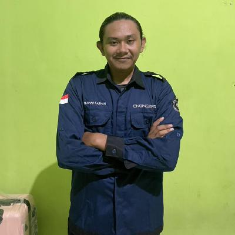

# Muamar Farhan - Backend Developer Portfolio

  
  
  # Hi, I'm Muamar Farhan 👋
  
  **Backend Developer** | **Freelancer** | **Student**
  
  
  
  
  

---

## 🚀 About Me

I'm a dedicated backend developer with over 2 years of experience in developing reliable and scalable systems. My passion for coding began during vocational high school (SMK), where I was first introduced to software development. Since then, I have continued to grow my skills through hands-on projects, freelance work, and academic studies.

I specialize in building modern web applications using **Laravel**, **PHP**, and **Filament**. I focus on creating robust backend architectures, RESTful APIs, and clean, maintainable code that ensures scalability and performance.

Outside of backend development, I spend my time learning about digital marketing and enhancing my frontend skills to grow into a well-rounded full-stack developer.

## 🛠️ Technologies & Tools

## 📊 Stats

- **10+** Projects Completed
- **1+** Years of Experience
- **100%** Dedicated to Quality

## 🎓 Education & Experience

### 🎓 Education
- **Bachelor of Information System** - University of Tadulako (2020 - 2025)
  - Currently pursuing degree focusing on software development, database management, and system analysis
  - Skills: Information System Development Project, Information Systems Architecture, Data Structures, Algorithms, Database Design

### 💼 Experience
- **Backend Engineer Internship** - PT. Ruang Raya Indonesia (August 2022 - December 2022)
  - Intensive 6-month program covering modern web development technologies and best practices
  - Skills: Figma, Golang, PostgreSQL, Docker, Github, RESTful API

## 🚀 Featured Projects

### 1. Sistem Informasi Sekolah

Sistem informasi sekolah yang membantu pengelolaan data siswa, guru, dan administrasi sekolah secara efisien.

### 2. Sistem Informasi Pariwisata Daerah

Sistem informasi pariwisata yang membantu pengelolaan data wisata, pengunjung, dan administrasi pariwisata secara efisien.

### 3. Portfolio Website

Responsive portfolio website built with modern web technologies.

---

## 📫 Get In Touch

I'm always interested in new opportunities and interesting projects. Let's connect!

- 📧 **Email**: [muamarfarhan07@gmail.com](mailto:muamarfarhan07@gmail.com)
- 📱 **WhatsApp**: [+62 821-9373-4482](https://wa.me/6282193734482)
- 📍 **Location**: Palu, Indonesia
- 💼 **LinkedIn**: [Muamar Farhan](https://www.linkedin.com/in/muamar-farhan-205259222/)
- 🐙 **GitHub**: [@Ruinz1](https://github.com/Ruinz1)
- 📸 **Instagram**: [@_muamarfarhan_](https://www.instagram.com/_muamarfarhan_/)

---

  
© 2024 Muamar Farhan. All rights reserved. Built with ❤️ using React & Tailwind CSS.

